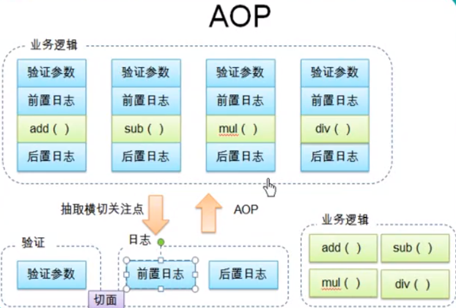

### lib下jar包下载地址
[用到的jar包]("https://repo.spring.io/libs-release-local/org/springframework/spring/")
[而不是源码包](https://repo.spring.io/libs-release-local/org/springframework/spring/)
- Project Structure添加上面的lib
- 然后右击 Add Framework Support -> spring,它会自己找到我们导入的bean包
这一步后可以创建spring config xml
---
### Common logging 实现类查找
1. 首先在classpath下寻找自己的配置文件commons-logging.properties，如果找到，则使用其中定义的Log实现类
2. 如果找不到commons-logging.properties文件，则在查找是否已定义系统环境变量org.apache.commons.logging.Log，找到则使用其定义的Log实现类
3. 否则，查看classpath中是否有Log4j的包，如果发现，则自动使用Log4j作为日志实现类
4. 否则，使用JDK自身的日志实现类（JDK1.4以后才有日志实现类）
5. 否则，使用commons-logging自己提供的一个简单的日志实现类SimpleLog

### 使用外部属性文件
- 目的:使文件路径,数据源配置等信息和bean配置文件分离
1. 首先导入spring jdbc包,
org.springframework.jdbc.datasource.DriverManagerDataSource类实现了javax.sql.DataSource接口,只是基本实现,没有提供连接池的机制,
也可以用c2p0 ComboPooledDataSource,从名字上看,它是有连接池的
2. add jar mysql-connector-java-8.0.15.jar
```
sudo apt-get install mysql-connector-java
dpkg -L mysql-connector-java
```

### spring是如何将xml中定义的bean放到BeanFactory中的
- RootBeanDefinition mbd 包含username,password,url等,其中用户名密码不正确,不是xml中定义的

preInstantiateSingletons for循环创建bean beanNames包含dataSource
```
org/springframework/beans/factory/support/AbstractBeanFactory.java 函数 getBean 320行

createBean(beanName, mbd, args);创建一个bean实例,并返回

doCreateBean

 instantiate  in SimpleInstantiationStrategy.java
 获取到默认构造器

  instantiateClass BeanUtils.java
  使用传入的构造器初始化类
  
 populateBean 给username等赋值

```

### spEL

### IOC容器可以在bean的生命周期注入回调
1. 通过构造器或工厂方法创建Bean实例并放到BeanFactory
2. 设置Bean属性
3. (可省) postProcessBeforeInitialization-> 
    初始化 init-method -> 
    postProcessAfterInitialization
4. 使用
5. (可省)去初始化 destroy-method

### 配置 bean
- 方式: 基于xml, 基于注解
- 创建: 通过全类名(反射),静态工厂方法(StaticCarFactory),实例工厂方法(InstanceCarFactory),
FactoryBean(spring提供)

### 注解方式创建bean
- 注解Component(Repository,Service,Controller)
- xml指定context:component-scan

### 泛型依赖注入
父类泛型依赖,子类会继承这个关系

### AOP
- 非业务需求(日志和验证等)加入后,业务方法兼顾多个关注点,造成代码混乱
- 日志和验证这样的代码分散在多个模块或方法中,如果需求发生变化,必须修改多个模块
1. 动态代理
2. 面向切面编程比动态代理更简单 AspectJ

- aspectjweaver-1.9.3.jar aspectjrt-1.9.3.jar from maven

